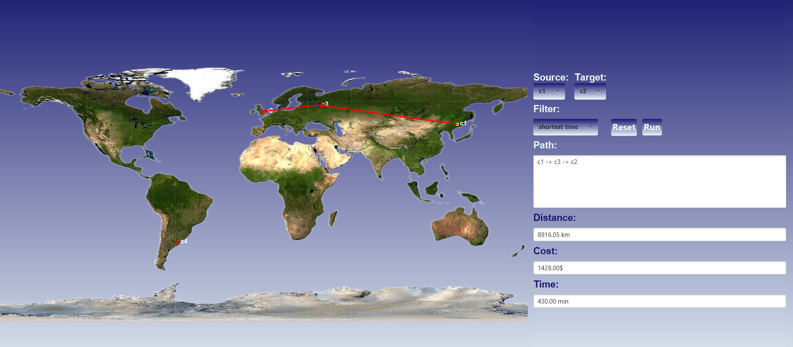

# Best travel route

This project is a program written in **Java** with a **JavaFX** interface. It shows and calculates the shortest paths between cities using **Dijkstra's Algorithm**.

---

## 📌 Features

* Shows cities and roads as a **Graph**.
* Uses **Dijkstra's Algorithm** to find the shortest paths.
* Supports different criteria: **distance, cost, time**.
* Graphical interface to display cities, roads, and paths on the map.

---

## 📂 Project Structure

* `City.java`
  Represents a city (name + coordinates on the map).

* `Road.java`
  Represents a road between two cities (distance, cost, time).

* `Graph.java`
  Holds all cities and roads and makes it easy to add or search.

* `Dijkstra.java`
  Implements **Dijkstra's Algorithm** to find the shortest paths.

* `Main.java`
  The main file that runs the program and shows the JavaFX interface.

---

## ▶️ How to Run

1. Make sure **Java 8 or higher** and **JavaFX** are installed.
2. Import the project into **IntelliJ IDEA**, **Eclipse**, or any JavaFX-supported IDE.
3. Run the file:

   ```bash
   Main.java
   ```
4. Choose the source and target cities and see the shortest path displayed on the map.

---

## 📖 Dijkstra's Algorithm

The algorithm works by repeatedly selecting the nearest unvisited city and updating the distances to its neighbors until reaching the destination.
You can choose **distance, cost, or time** as the calculation criteria.

---

## ✨ Future Improvements

* Make the user interface more interactive.
* Save and load city and road data from a file or database.

---

## JavaFX Interface


